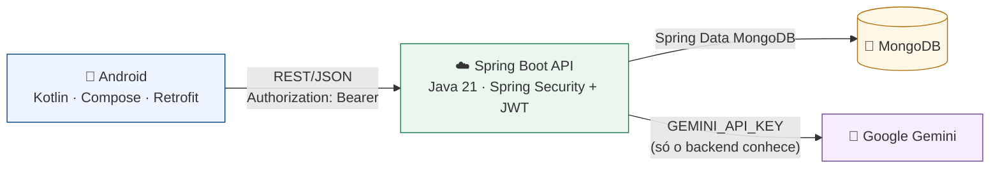

# InovaGAB — Plataforma de Inovação Corporativa

Projeto acadêmico **FIAP / Grupo Águia Branca**.
Aplicativo Android + API REST própria para captar, avaliar e transformar ideias
dos operadores em projetos com resultado mensurável.

> **Sprint 2** — o aplicativo deixou de depender de Firebase/Firestore e passou a
> consumir um backend REST real em Spring Boot, com MongoDB, autenticação JWT,
> autorização por perfil no servidor e análise de ideias por IA (Google Gemini).

> ### 📦 O backend é entregue separadamente
>
> O backend Spring Boot é entregue separadamente no arquivo
> **`Backend_InovaGAB.zip`**. Para executar a solução completa, extraia os dois
> pacotes no mesmo diretório ou siga as instruções do README presente no pacote
> do backend.
>
> Os comandos deste README que começam com `cd backend` pressupõem essa
> estrutura — ou seja, a pasta `backend/` ao lado da pasta do aplicativo Android:
>
> ```
> InovaGAB/
> ├── app/ · gradle/ · gradlew · build.gradle.kts   (Android_InovaGAB.zip)
> └── backend/                                       (Backend_InovaGAB.zip)
> ```

---

## Índice

1. [Objetivo](#1-objetivo)
2. [Arquitetura](#2-arquitetura)
3. [Tecnologias](#3-tecnologias)
4. [Pré-requisitos](#4-pré-requisitos)
5. [Passo a passo: subir tudo](#5-passo-a-passo-subir-tudo)
6. [Usuários de teste](#6-usuários-de-teste)
7. [Configurar a URL da API no Android](#7-configurar-a-url-da-api-no-android)
8. [Configurar o Gemini](#8-configurar-o-gemini)
9. [Testar cada perfil](#9-testar-cada-perfil)
10. [Endpoints e regras de autorização](#10-endpoints-e-regras-de-autorização)
11. [Gerar o APK](#11-gerar-o-apk)
12. [Testes automatizados](#12-testes-automatizados)
13. [Estrutura do repositório](#13-estrutura-do-repositório)

---

## 1. Objetivo

Dar ao Grupo Águia Branca um canal estruturado de inovação, ligando três perfis:

| Perfil | Papel |
|---|---|
| **Operador** | Lê as orientações estratégicas vigentes e submete ideias; acompanha o status e sua posição no ranking |
| **Gestor** | Avalia as ideias, prioriza, aprova ou rejeita, pede uma análise da IA e converte as aprovadas em projetos |
| **Liderança** | Publica e versiona as orientações estratégicas, acompanha os projetos e lê os indicadores (ROI, retorno, redução de custos, produtividade) |

---

## 2. Arquitetura



Diagramas detalhados (camadas, fluxo de login, ciclo da ideia, modelo de dados):
[`docs/architecture.md`](docs/architecture.md).

---

## 3. Tecnologias

**Backend** — Java 21 · Spring Boot 3.5 · Spring Web · Spring Security · JWT (jjwt) ·
BCrypt · Bean Validation · Spring Data MongoDB · springdoc-openapi (Swagger UI) · Maven

**Banco** — MongoDB 7 (coleções `users`, `strategies`, `strategy_history`, `ideas`, `projects`)

**Android** — Kotlin · Jetpack Compose · Material 3 · Navigation Compose ·
Retrofit · OkHttp (interceptor de JWT) · Gson · DataStore Preferences

**IA** — Google Gemini API (`generateContent`), chamada exclusivamente pelo backend

---

## 4. Pré-requisitos

| Ferramenta | Versão | Onde obter | Observação |
|---|---|---|---|
| **JDK 21** | 21.x | [adoptium.net](https://adoptium.net/temurin/releases/?version=21) | Necessário para o backend. O JBR que vem com o Android Studio também serve (`<Android Studio>/jbr`) |
| **Android Studio** | Ladybug ou mais novo | [developer.android.com/studio](https://developer.android.com/studio) | Para abrir e rodar o app |
| **Android SDK** | compileSdk 36, minSdk 28 | Instalado pelo próprio Android Studio | No primeiro boot ele baixa o SDK e oferece criar um emulador |
| **Docker Desktop** | qualquer recente | [docker.com/products/docker-desktop](https://www.docker.com/products/docker-desktop/) | Caminho mais simples para o MongoDB. Opcional se você instalar o Mongo direto |
| **MongoDB** | 7 | [mongodb.com/try/download/community](https://www.mongodb.com/try/download/community) | Só precisa baixar se **não** for usar Docker |
| Maven | — | — | **Não precisa instalar**: o projeto usa o wrapper `./mvnw` |
| Gradle | — | — | **Não precisa instalar**: o projeto usa o wrapper `./gradlew` |

Nenhuma conta ou serviço pago é necessário para executar as funcionalidades
principais. A chave do Google Gemini é opcional e necessária apenas para testar a
funcionalidade de análise por IA — veja a [seção 8](#8-configurar-o-gemini).

Confirme o Java:

```bash
java -version     # deve mostrar 21.x
```

Se o `java` do sistema não for 21, aponte o `JAVA_HOME` para o JBR do Android Studio:

```bash
# Git Bash / Linux / macOS
export JAVA_HOME="/c/Program Files/Android/Android Studio/jbr"
```
```powershell
# PowerShell
$env:JAVA_HOME = "C:\Program Files\Android\Android Studio\jbr"
```

---

## 5. Passo a passo: subir tudo

### 5.1 MongoDB

```bash
cd backend
docker compose up -d
```

Conferir:

```bash
docker exec inovagab-mongo mongosh --quiet --eval "db.runCommand({ping:1}).ok"   # imprime 1
```

Sem Docker: instale o MongoDB Community Server e deixe-o em `localhost:27017`.
O banco `inovagab` é criado sozinho.

### 5.2 Variáveis de ambiente

**Para só rodar e avaliar o projeto, você pode pular esta etapa inteira.** As duas
variáveis são opcionais no ambiente local:

| Variável | Se você não definir |
|---|---|
| `JWT_SECRET` | A API usa um segredo de desenvolvimento embutido e sobe normalmente |
| `GEMINI_API_KEY` | A API sobe normalmente; apenas o botão "Analisar com IA" responde com um aviso |

Para definir mesmo assim, use o **mesmo terminal** em que vai iniciar a API:

```bash
export JWT_SECRET="troque-por-um-segredo-aleatorio-de-no-minimo-32-caracteres"
export GEMINI_API_KEY="sua-chave-do-gemini"
```
```powershell
$env:JWT_SECRET = "troque-por-um-segredo-aleatorio-de-no-minimo-32-caracteres"
$env:GEMINI_API_KEY = "sua-chave-do-gemini"
```

> Definir a variável **depois** que a API já subiu não tem efeito: pare e inicie de novo.
> O arquivo [`backend/.env.example`](backend/.env.example) é apenas uma referência de
> quais variáveis existem — o Spring Boot **não** lê arquivos `.env` automaticamente.

**Nenhuma credencial real é versionada.**

### 5.3 Backend

```bash
cd backend
./mvnw spring-boot:run          # Git Bash / Linux / macOS
mvnw.cmd spring-boot:run        # PowerShell / cmd
```

Pronto quando aparecer `Started BackendApplication`. Verifique:

```bash
curl http://localhost:8080/api/health
# {"service":"inovagab-backend","status":"UP","timestamp":"..."}
```

No primeiro boot os usuários de demonstração e a massa de exemplo são criados
(8 usuários, 7 orientações estratégicas, 30 ideias e 12 projetos). O seed é
**idempotente**: reiniciar não duplica nada e não sobrescreve o que você editar
pelo app.

### 5.4 Android

1. Abra a pasta raiz do repositório no **Android Studio** (não a pasta `app/`).
2. Aguarde o *Gradle sync*. O arquivo `local.properties`, que aponta o caminho do
   SDK, é gerado automaticamente pelo Android Studio — por isso não é versionado.
3. Crie/inicie um **emulador** (API 28+): *Device Manager* → *Create Device*.
4. Rode a configuração **app**.

**Pela linha de comando**, o Gradle precisa saber onde está o Android SDK. Se você
nunca abriu o projeto no Android Studio, o `local.properties` ainda não existe e o
build falha com `SDK location not found`. Resolva de uma das duas formas:

```bash
# Opção A — criar o local.properties (ajuste o caminho do seu SDK)
echo "sdk.dir=C:/Users/SEU-USUARIO/AppData/Local/Android/Sdk" > local.properties

# Opção B — exportar a variável de ambiente
export ANDROID_HOME="/c/Users/SEU-USUARIO/AppData/Local/Android/Sdk"
```
```powershell
# PowerShell — opção B
$env:ANDROID_HOME = "C:\Users\SEU-USUARIO\AppData\Local\Android\Sdk"
```

O caminho do SDK aparece no Android Studio em
*Settings → Languages & Frameworks → Android SDK*. Depois disso:

```bash
./gradlew :app:installDebug     # compila e instala no emulador já aberto
```

O app já aponta para `http://10.0.2.2:8080/`, que é como o emulador enxerga o
`localhost` da sua máquina. Não é preciso mudar nada para a demonstração padrão.

---

## 6. Usuários de teste

Senha de todos: **`123456`**

| E-mail | Perfil | Onde entra |
|---|---|---|
| `operador@app.com` | OPERADOR | Card "Operador" na tela de login |
| `gestor@app.com` | GESTOR | Card "Gestor" |
| `lider@app.com` | LIDERANCA | Card "Liderança" |
| `ana.souza@app.com` | OPERADOR | Líder do ranking — entre por aqui para ver o 1º lugar |
| `carlos.nunes@app.com` | OPERADOR | 3º no ranking |
| `marcos.vieira@app.com` | OPERADOR | 4º no ranking |
| `juliana.prado@app.com` | OPERADOR | 5º no ranking |
| `beatriz.lima@app.com` | OPERADOR | 6º no ranking |

Os três cards de acesso rápido da tela de login continuam funcionando: eles
preenchem o formulário e chamam `POST /api/auth/login` de verdade. Os demais
operadores existem para dar corpo ao ranking e são acessados digitando o e-mail.

---

## 7. Configurar a URL da API no Android

A URL fica em **um único lugar** — `buildConfigField` em
[`app/build.gradle.kts`](app/build.gradle.kts) — e é lida por `ApiClient` via
`BuildConfig.API_BASE_URL`. Nenhuma tela conhece o endereço do servidor.

| Cenário | URL |
|---|---|
| **Android Emulator** (padrão) | `http://10.0.2.2:8080/` |
| Celular físico na mesma rede Wi-Fi | `http://<IP-DA-SUA-MAQUINA>:8080/` |
| Backend publicado | `https://seu-dominio/` |

Para trocar sem editar código, passe a propriedade Gradle:

```bash
./gradlew :app:assembleDebug -PINOVAGAB_API_URL=http://192.168.0.15:8080/
```

Ou fixe no `gradle.properties`:

```properties
INOVAGAB_API_URL=http://192.168.0.15:8080/
```

**Celular físico:** além da URL, adicione o IP da máquina em
[`app/src/main/res/xml/network_security_config.xml`](app/src/main/res/xml/network_security_config.xml)
— o Android bloqueia HTTP em texto puro por padrão, e o arquivo libera apenas os
hosts de desenvolvimento listados nele.

---

## 8. Configurar o Gemini

1. Gere uma chave em https://aistudio.google.com/app/apikey
2. Exporte **antes** de iniciar o backend:

```bash
export GEMINI_API_KEY="sua-chave"
export GEMINI_MODEL="gemini-3.5-flash"   # opcional: o modelo é configurável
```

3. No app, logue como **gestor**, abra uma ideia e toque em **"Analisar com IA"**.

A chave **nunca** entra no aplicativo Android. O fluxo é sempre
`Android → nosso backend → Gemini`. Sem a chave configurada, o endpoint responde
`503` com mensagem amigável e o restante do sistema continua funcionando normalmente.

Detalhes da validação da resposta da IA: [`backend/README.md`](backend/README.md#7-integração-com-ia-funcionalidade-plus).

---

## 9. Testar cada perfil

Em todos os perfis a **tela de início já é o painel de indicadores** daquele
perfil — não há um menu que leva a outra tela para ver os números. O que a
barra inferior alcança não aparece repetido como card.

### Operador — `operador@app.com`

1. **Início** → desempenho pessoal (`GET /api/dashboard/my-performance`): pontos, posição no ranking, distância para o líder, situação das próprias ideias e o funil enviadas → aprovadas → viraram projeto, com a regra de pontuação à vista.
2. **Cadastrar nova ideia** → preencha e escolha uma orientação no seletor. Ao salvar: **+10 pontos**. Também acessível pelo **+** no topo de *Minhas Ideias*.
3. **Ideias** (aba) → mostra **apenas as suas** (`GET /api/ideas/my`). Enquanto a ideia não é avaliada, dá para **editar** e **excluir**.
4. **Estratégias** (aba) → orientações vigentes publicadas pela liderança (`GET /api/strategies?activeOnly=true`).
5. **Ranking de inovadores** → sua posição e pontuação, vindas do backend.
6. **Perfil** (aba) → nome, e-mail, perfil e pontos, de `GET /api/auth/me`.

### Gestor — `gestor@app.com`

1. **Início** → painel de curadoria (`GET /api/dashboard/curation`): taxa de aproveitamento, fila por status, funil de projetos gerados e ideias por área. Não expõe nenhum dado financeiro.
2. **Ideias** (aba) → todas as ideias, com abas de filtro por status (o filtro é feito no backend).
3. Abra uma ideia → **Priorizar**, **Aprovar** ou **Reprovar**.
4. **Analisar com IA** → notas de impacto, viabilidade, inovação e alinhamento estratégico, com recomendação e justificativa. A análise fica salva na ideia.
5. Em uma ideia **aprovada** → **Criar Projeto** (a ideia é marcada como convertida e o operador ganha **+100 pontos**).
6. **Projetos** (aba) → criar, editar e registrar resultados (investimento, retorno, redução de custos, produtividade, etapa, prazo).
7. **Relatórios** → exporta ideias, projetos e ranking em CSV (`;` e UTF-8, abre no Excel em português) pelo menu de compartilhamento do Android.

### Liderança — `lider@app.com`

1. **Início** → dashboard completo (`GET /api/dashboard/summary`): ROI, investimento, retorno, lucro, redução de custos, produtividade média, projetos por status e funil de inovação — **tudo calculado no backend**.
2. **Indicadores** → o mesmo recorte por orientação estratégica (`GET /api/dashboard/strategies/{id}`), com ROI comparável entre as orientações.
3. **Estratégia** (aba) → CRUD completo: criar, editar, ativar/desativar e excluir.
4. Ícone de **histórico** em cada card → todas as versões, com ação (`CRIADA`, `ATUALIZADA`, `DESATIVADA`, `EXCLUIDA`), data e autor.
5. **Projetos** (aba) → acompanhamento em modo leitura.

### Verificando que a autorização é real

O jeito mais convincente de mostrar isso na apresentação é fora do app, porque
esconder botão não é segurança:

```bash
API=http://localhost:8080/api
OP=$(curl -s -X POST $API/auth/login -H "Content-Type: application/json" \
  -d '{"email":"operador@app.com","password":"123456"}' | grep -o '"token":"[^"]*"' | cut -d'"' -f4)

curl -s -o /dev/null -w "sem token:        %{http_code}\n" $API/strategies
curl -s -o /dev/null -w "operador/dashboard: %{http_code}\n" $API/dashboard/summary -H "Authorization: Bearer $OP"
curl -s -o /dev/null -w "operador/ideias:    %{http_code}\n" $API/ideas -H "Authorization: Bearer $OP"
# 401, 403, 403
```

---

## 10. Endpoints e regras de autorização

Tabela completa, payloads, respostas e erros: [`docs/endpoints.md`](docs/endpoints.md).
Swagger UI (com a API rodando): **http://localhost:8080/swagger-ui.html**

### Principais

| Método | Rota | Roles |
|---|---|---|
| POST | `/api/auth/login` | público |
| GET | `/api/auth/me` | todas |
| GET | `/api/strategies` | OPERADOR · GESTOR · LIDERANCA |
| POST/PUT/DELETE | `/api/strategies[/{id}]` | **LIDERANCA** |
| GET | `/api/strategies/{id}/history` | **LIDERANCA** |
| POST | `/api/ideas` | **OPERADOR** |
| GET | `/api/ideas/my` | **OPERADOR** |
| GET | `/api/ideas` | **GESTOR** |
| GET/PUT/DELETE | `/api/ideas/{id}` | OPERADOR **dono** · GET também GESTOR |
| PATCH | `/api/ideas/{id}/priority` · `/status` | **GESTOR** |
| POST | `/api/ideas/{id}/ai-analysis` | **GESTOR** |
| GET | `/api/projects[/{id}]` | GESTOR · LIDERANCA |
| POST/PUT/DELETE | `/api/projects[/{id}]` | **GESTOR** |
| GET | `/api/dashboard/summary` · `/strategies/{id}` · `/projects/{id}` | **LIDERANCA** |
| GET | `/api/dashboard/curation` | GESTOR · LIDERANCA |
| GET | `/api/dashboard/my-performance` | **OPERADOR** |
| GET | `/api/ranking` · `/api/ranking/me` | todas |

`/api/dashboard` tem um recorte por perfil. Só o da liderança expõe
investimento, retorno e ROI; o do gestor devolve apenas contagens da curadoria
e o do operador apenas os números do dono do token.

### Como a autorização é garantida

1. **`SecurityConfig`** casa rota + método HTTP + role. Um operador em
   `GET /api/dashboard/summary` leva `403` antes de qualquer código de negócio rodar.
2. **Services** aplicam a regra de dono. Trocar o id na URL de `GET /api/ideas/{id}`
   para a ideia de outro operador também dá `403`.
3. O **`operatorId` nunca vem do corpo da requisição** — é sempre lido do JWT.
4. A **role nunca vem do cliente** — vem assinada dentro do token.

### Regras de pontuação do ranking

| Evento | Pontos |
|---|---|
| Cadastrar uma ideia | +10 |
| Ideia aprovada pelo gestor | +50 |
| Ideia convertida em projeto | +100 |

Cada evento credita uma única vez, garantido por marcadores no documento da ideia.

---

## 11. Gerar o APK

> Pela linha de comando o Gradle precisa localizar o Android SDK. Se aparecer
> `SDK location not found`, veja [a seção 5.4](#54-android) — é só criar o
> `local.properties` ou exportar `ANDROID_HOME`.

**Debug** (aponta para `10.0.2.2:8080`, ideal para o emulador):

```bash
./gradlew :app:assembleDebug
# app/build/outputs/apk/debug/app-debug.apk
```

**Release** apontando para um backend acessível na rede:

```bash
./gradlew :app:assembleRelease -PINOVAGAB_API_URL=http://192.168.0.15:8080/
# app/build/outputs/apk/release/app-release-unsigned.apk
```

> O build de release não está assinado. Para instalar em um dispositivo, use o APK
> de debug ou configure um `signingConfig` próprio.

Pelo Android Studio: **Build → Build Bundle(s) / APK(s) → Build APK(s)**.

---

## 12. Testes automatizados

```bash
cd backend
./mvnw test
```

64 testes, todos passando. Cobrem login válido e inválido, endpoint protegido sem
token, operador tentando acessar endpoints de liderança, CRUD de estratégia com
histórico, operador criando ideia, operador tentando manipular ideia de outro,
gestor aprovando ideia, criação de projeto a partir de ideia aprovada, cálculo do
ROI/dashboard e validação da resposta da IA.

Detalhamento em [`backend/README.md`](backend/README.md#9-testes).

Compilar o app Android:

```bash
./gradlew :app:assembleDebug
```

---

## 13. Estrutura do repositório

```
inova-gab/
├── app/                     Aplicativo Android (Kotlin + Jetpack Compose)
│   └── src/main/java/br/com/fiap/inovagab/
│       ├── InovaGabApplication.kt   inicializa Retrofit e recarrega o JWT salvo
│       ├── MainActivity.kt
│       ├── data/
│       │   ├── model/               modelos de domínio (um por conceito)
│       │   ├── remote/              ApiClient · ApiCall · api/ · dto/ · interceptor/
│       │   ├── repository/          Auth · Strategy · Idea · Project · Dashboard · Ranking
│       │   └── session/             TokenManager (DataStore)
│       ├── navigation/              Routes · AppNavGraph
│       └── ui/                      login · operador · gestor · lideranca · profile · components · theme
│
├── backend/                 API REST (Java 21 + Spring Boot + MongoDB)
│   ├── pom.xml · mvnw · docker-compose.yml · .env.example · README.md
│   └── src/main/java/br/com/fiap/inovagab/backend/
│       ├── ai/ config/ controller/ dto/ exception/ model/ repository/ security/ service/
│
├── docs/
│   ├── architecture.md      diagramas Mermaid (camadas, fluxos, modelo de dados)
│   └── endpoints.md         tabela de endpoints, payloads, respostas e erros
│
├── gradle/ · gradlew · settings.gradle.kts · build.gradle.kts
└── README.md                este arquivo
```

### O que mudou da Sprint 1 para a Sprint 2

| Sprint 1 | Sprint 2 |
|---|---|
| Firebase Authentication | `POST /api/auth/login` + JWT guardado em DataStore |
| Firestore acessado direto pelas telas | Retrofit → API REST → Spring Data MongoDB |
| `RankingService` sobre a coleção `operadores` do Firestore | `GET /api/ranking` com regras de pontuação no backend |
| `ProfileScreen` lendo Firestore | `GET /api/auth/me` |
| ROI e indicadores calculados dentro do app | `GET /api/dashboard/summary` calcula no servidor |
| `DemoDataRepository` populando o Firestore pelo app | Seed idempotente no backend, no boot |
| Permissões apenas visuais (esconder botão) | Spring Security por rota + role, e regra de dono nos services |
| Modelos duplicados (`Idea`/`Ideia`, `Project`/`Projeto`, `Strategy`/`Estrategia`) | Um modelo por conceito em `data/model` |
| — | Análise de ideias por IA (Google Gemini), com a chave só no backend |
| — | Histórico versionado das orientações estratégicas |
| — | 64 testes automatizados no backend |
