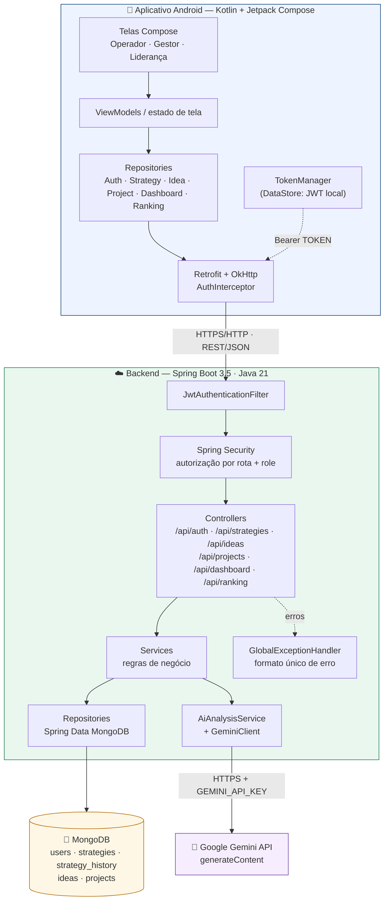
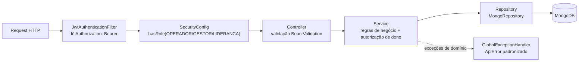
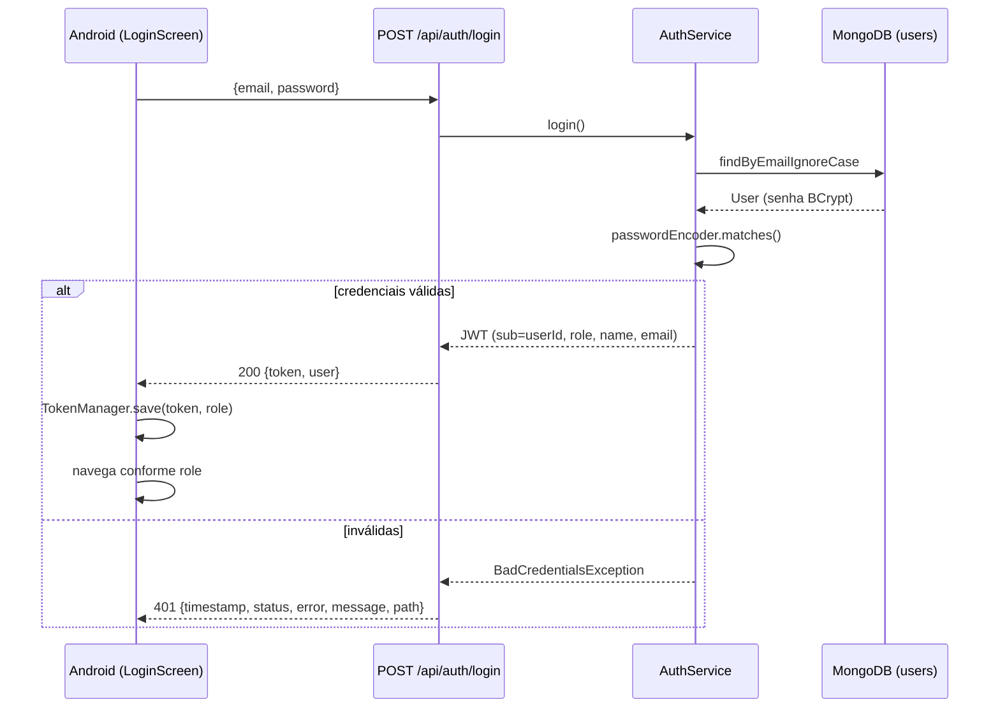
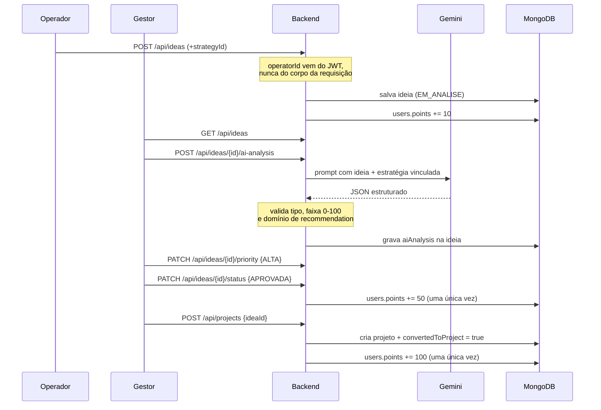
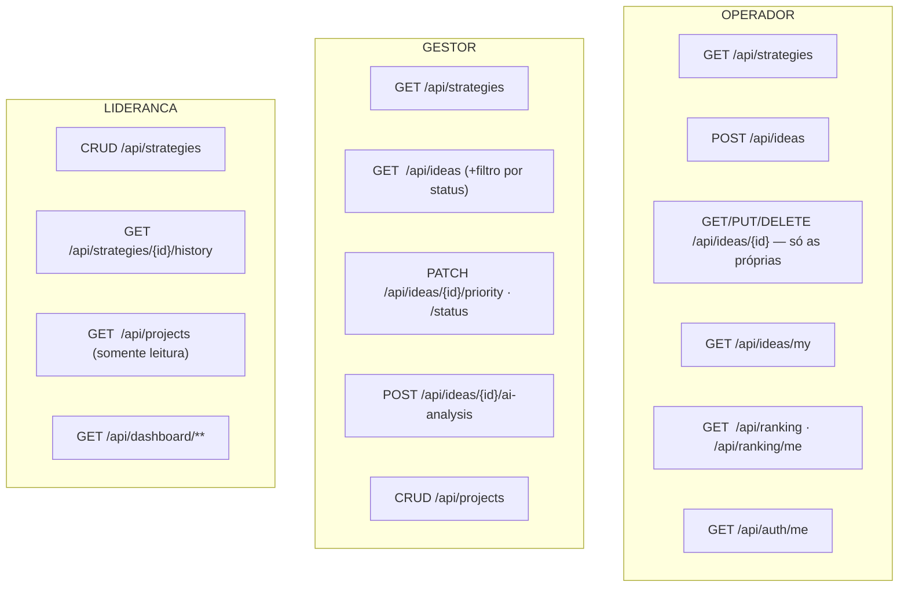
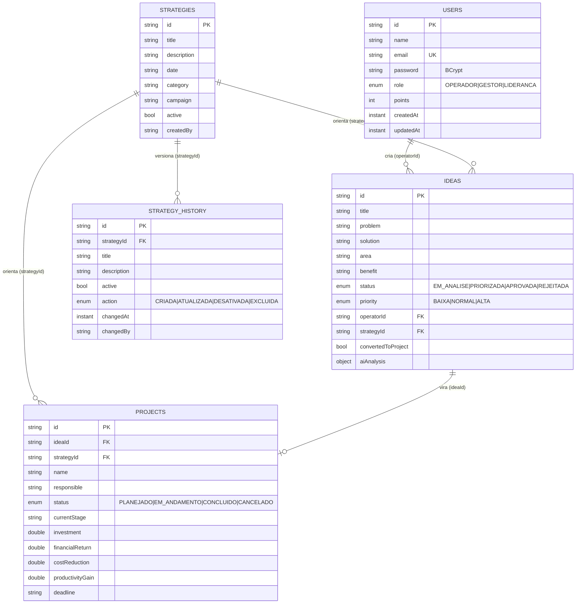

# Arquitetura — InovaGAB (Sprint 2)

Projeto FIAP / Grupo Águia Branca. A Sprint 2 removeu a dependência de
Firebase/Firestore e passou o aplicativo Android a consumir um backend REST
próprio, em Spring Boot, com MongoDB e integração com o Google Gemini.

---

## 1. Visão geral



**Regra de ouro da integração com IA:** a chave do Gemini nunca sai do backend.

```
Android  →  nosso backend  →  Gemini          ✅ implementado
Android  →  Gemini                            ❌ nunca acontece
```

---

## 2. Camadas do backend



Nenhuma regra de negócio vive no controller: ele valida o payload, chama o
service e devolve o status HTTP correto.

### Pacotes

```
backend/src/main/java/br/com/fiap/inovagab/backend/
├── BackendApplication.java
├── ai/            GeminiProperties · GeminiClient · AiAnalysisService · AiScoreResult
├── config/        OpenApiConfig · DataSeeder (seed idempotente)
├── controller/    Auth · Strategy · Idea · Project · Dashboard · Ranking · Health
├── dto/           auth · strategy · idea · project · dashboard · ranking
├── exception/     ApiError · ApiException + subclasses · GlobalExceptionHandler
├── model/         User · Strategy · StrategyHistory · Idea · Project · AiAnalysis + enums
├── repository/    interfaces Spring Data MongoDB
├── security/      SecurityConfig · JwtService · JwtAuthenticationFilter
│                  AuthenticatedUser · CurrentUser · handlers 401/403
└── service/       Auth · User · Strategy · Idea · Project · Dashboard · Ranking
```

---

## 3. Fluxo de autenticação



Depois do login, **toda** requisição sai do app com
`Authorization: Bearer <token>`, injetado pelo `AuthInterceptor` do OkHttp.

---

## 4. Fluxo da ideia: do operador ao projeto



---

## 5. Autorização por perfil



A autorização é aplicada em **duas camadas**:

1. **`SecurityConfig`** — rota + método HTTP + role. Um operador que chame
   `GET /api/dashboard/summary` recebe `403` antes de qualquer código de negócio rodar.
2. **Service** — regra de dono. Um operador que troque o id na URL de
   `GET /api/ideas/{id}` recebe `403` porque `IdeaService` compara o
   `operatorId` da ideia com o id do JWT.

Esconder um botão no Android **não** é considerado segurança em nenhum ponto do projeto.

---

## 6. Modelo de dados (MongoDB)



---

## 7. Camada de rede no Android

```
app/src/main/java/br/com/fiap/inovagab/
├── InovaGabApplication.kt      inicializa ApiClient e recarrega o JWT salvo
├── data/
│   ├── model/                  modelos de domínio únicos (sem duplicação)
│   ├── remote/
│   │   ├── ApiClient.kt        Retrofit singleton (BASE URL vem do BuildConfig)
│   │   ├── ApiCall.kt          traduz HttpException/IOException em mensagem amigável
│   │   ├── api/                interfaces Retrofit por recurso
│   │   ├── dto/                espelham o JSON + Mappers.kt para o domínio
│   │   └── interceptor/        AuthInterceptor (Bearer token)
│   ├── repository/             Auth · Strategy · Idea · Project · Dashboard · Ranking
│   └── session/TokenManager.kt DataStore + cache em memória para o interceptor
├── navigation/                 Routes · AppNavGraph
└── ui/                         login · operador · gestor · lideranca · profile · components
```

A URL base fica em **um único lugar** (`buildConfigField` em
`app/build.gradle.kts`), com padrão `http://10.0.2.2:8080/` — o endereço do host
visto de dentro do Android Emulator.

---

## 8. Decisões de projeto

| Decisão | Motivo |
|---|---|
| Spring Data MongoDB, não JPA/Hibernate | O banco é NoSQL orientado a documentos; forçar JPA sobre documentos seria artificial. |
| `aiAnalysis` embutido no documento da ideia | Relação 1:1 e sempre lida junto com a ideia — evita um join desnecessário. |
| `strategy_history` em coleção separada | Histórico é append-only e cresce sem limite; manter fora do documento evita estourar o tamanho do documento. |
| Flags `...PointsAwarded` na ideia | Tornam a pontuação idempotente sem precisar de transação distribuída. |
| Resposta do Gemini validada campo a campo | Modelo de linguagem pode devolver texto fora do formato; nota fora de 0-100 é limitada e `recommendation` desconhecida cai para um valor derivado do score. |
| ROI = 0 quando investimento é 0 | Evita divisão por zero: sem capital aplicado não há retorno percentual a medir. |
| DTOs próprios em todas as respostas | O documento `User` nunca chega ao cliente — a senha (mesmo em hash) jamais é serializada. |
